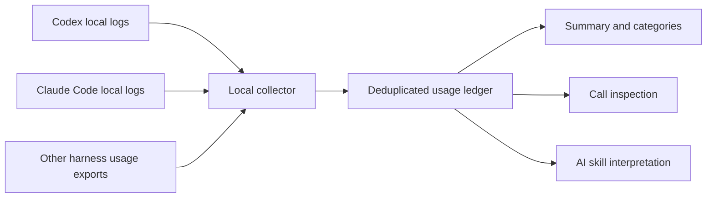

# Token Explorer

[](https://github.com/krisnaparahita/Ai-tokenExplorer/actions/workflows/validate.yml)

Token Explorer shows where your AI tokens go, in plain English. It reads the usage records your AI tools already keep on your computer and answers questions like: how much did I use last week, which conversation was the heaviest, and what happened inside that one expensive prompt. Because it is just Markdown plus a few standard-library Python scripts, it works with any agent that supports skills.

It reads **Codex** and **Claude Code** logs natively, and any other tool that writes usage to a local folder through a small import format. Install it in Codex, in Claude Code, or in both. Each works on its own, and nothing requires that your tools hand work to each other. If they do (Claude calling Codex, or Codex calling Claude), that work is traced back to the task that caused it.

Everything runs on your computer. The collector makes no network requests and uses no model tokens. Asking an AI to explain a report uses that AI's normal tokens.

> Transparency means showing what is measured, what is missing, and what is only a clue. This tool does not claim to see hidden provider internals or to recover usage that was never logged.

## Installation

Install Token Explorer with the Skills CLI:

```bash
npx skills add krisnaparahita/Ai-tokenExplorer --global
```

Leave off `--global` to install it only in the current project. Add `--agent <name>` or `--agent '*'` to choose which agents receive it, then reload their skills. The skill answers to `/token-audit`.

Claude Code 2.1.142 or newer can install the plugin instead:

```text
/plugin marketplace add krisnaparahita/Ai-tokenExplorer
/plugin install token-audit@token-audit
```

The plugin answers to `/token-audit:token-audit`.

To install from a clone, pick the tool you use:

```bash
git clone https://github.com/krisnaparahita/Ai-tokenExplorer.git
cd Ai-tokenExplorer
python3 scripts/install.py --target codex    # Codex only
python3 scripts/install.py --target claude   # Claude Code only
python3 scripts/install.py                   # both
```

The installer never overwrites an existing copy, and installing for one tool never blocks the other. It changes no shell files, hooks, or credentials. To upgrade, replace the installed folder after checking it for local changes.

In the Claude desktop app, download this repository as a ZIP and upload it as a skill, or copy `SKILL.md` and the `scripts/` and `references/` folders into the agent's skill folder. See the note below about where the desktop app can and cannot read your logs.

### Where it can measure usage

| Where you use AI | Works? |
|---|---|
| Claude Code in a terminal, the desktop app's code sessions, or an IDE | Yes. Reads `~/.claude/projects`. |
| Codex in a terminal or the Codex app | Yes. Reads `$CODEX_HOME/sessions` (default `~/.codex/sessions`). |
| Both tools, with or without one starting the other | Yes. Hand-offs are linked when the logs show them. |
| Another tool that writes per-request usage to a local folder | Yes, through the [import format](references/adapters.md). |
| Chat in a browser or phone app, or any cloud-only tool | No. There is no local log to read. |
| A chat app that runs uploaded skills in a cloud sandbox | Installs, but the sandbox usually cannot see the log folders on your computer, so it cannot collect on its own. Use Claude Code or Codex for automatic collection. This depends on the app version, so check yours. |

Python 3.9 or newer is required. No third-party packages are needed. Reading your own logs needs read access to the folders above.

## Usage

Call the skill directly:

```text
/token-audit how much AI did I use last week?
```

In Codex the same skill answers to `$token-audit`. Or ask in plain language:

```text
Show me my top conversations from the last 7 days.
Why was my most expensive prompt so big?
Make me a report I can look at.
```

Useful requests:

| You want | Ask for |
|---|---|
| A page anyone can read | "Make me a plain-English report for last week" |
| Totals for a period | "Summarise my usage for the last day / 3 days / this month" |
| Your top sessions | "What were my top conversations last week?" |
| One prompt taken apart | "Deep-dive the heaviest prompt from yesterday" |
| A specific conversation | "Look only at session `<id>`" |

The skill states the exact time range it used every time. If "last week" could mean the previous Monday to Sunday or the past seven days, it says which it picked.

## See it, in plain English

Every scan also writes **`report.html`** next to the ledger: one self-contained page (no internet, no install, opens in any browser, light and dark mode) written for people who have never heard the word "token".

- A headline number with an everyday comparison ("about 4,000 pages of text").
- **Where did the effort go?** Fresh reading, reused-from-memory and writing, in one bar.
- **Who did the work?** Your own conversations versus helpers, hand-offs to other AIs, and automatic safety checks.
- **A headline that fits the period** ("Your AI week in review", day, month) and a highlights strip: busiest day, heaviest prompt, top conversation, most-used model.
- **Which conversations used the most?** The top five, named by how they began, with the helpers each one started included.
- **Which tasks were the heaviest?** Ranked, rated *Light / Typical / Heavy / Very heavy / Extreme* against **your own** typical task, with a *Simple / Multi-step / Team effort* label. Tap one to see what happened inside.
- **When were you busiest?**, **which tools and models**, and an honest "what this page cannot see".
- Every chart has a table view and a hover explanation; nothing depends on colour alone.

```sh
open "$HOME/.local/share/token-audit/report.html"     # macOS; use xdg-open on Linux
python3 scripts/html_report.py --ledger ~/.local/share/token-audit/ledger.jsonl --period last-week
```

It takes the same filters as the query tool: `--period last-week`, `--period 7d`, `--session ID`, `--harness codex`. For one prompt, `--task TASK_ID` builds a page that takes it apart step by step (see below). The page may contain snippets of your prompts (if you collected with `--include-prompts`), so check it before sharing.

## Choose a period, a session or one prompt

```sh
token-audit summary  --period last-day          # rolling 24 hours
token-audit summary  --period 7d                # rolling week; also 3d, 14d, 12h
token-audit summary  --period last-week         # the previous Monday to Sunday
token-audit summary  --period last-month        # the previous calendar month
token-audit summary  --period 2026-09-01..2026-09-07
token-audit sessions --period 7d                # conversations, biggest first
token-audit summary  --session SESSION_ID       # just that conversation, helpers included
token-audit prompts  --period last-week --search "invoice"
token-audit deep-dive TASK_ID --full-prompt     # one prompt, taken apart
```

Periods use your computer's local time zone and every answer states the exact range it covered. `week` and `month` on their own are rejected because they are ambiguous; use `7d` for a rolling week or `last-week` for the previous calendar week. A **prompt** means one message you sent plus everything it caused, including helpers, hand-offs and safety checks. `deep-dive` shows totals, the effort split, how the conversation grew, every helper and how it was linked, the largest steps, each step in order, and observations that are labelled as **fact** or **possible explanation**. It never claims a specific file or result "cost" a specific number of tokens. `--full-prompt` reads the complete prompt from your transcript and is opt-in because it is more private.

## Helpers, hand-offs and safety checks

Modern assistants start other AI sessions to do part of a job. Those sessions cost tokens but appear in separate log files, so most trackers show them as unrelated activity. Token Explorer joins them back to the task that caused them, and says how sure it is:

| Link | How it is established | Confidence |
|---|---|---|
| Claude sub-agent to the task that started it | The `agentId` recorded on the Agent/Task tool result | Exact |
| Codex helper or automatic safety review to its parent | The `parent_thread_id` Codex writes itself | Exact |
| One AI tool starting another (Claude to Codex, or Codex to Claude), through an MCP tool or a shell command such as `codex exec` or `claude -p` | The other tool's session began while the call was running and its first message is that call's prompt | **Inferred**; shown as such |

Anything that does not meet these rules stays its own task. Nothing else is guessed. A Codex session started directly from a terminal, or one whose parent Claude transcript was never saved (for example runs with `--no-session-persistence`), correctly stays unlinked.

## Optional cost estimate

Prices change and depend on your plan, so Token Explorer never ships or guesses them. To get a labelled *estimate*, copy `prices.example.json`, fill in the current rates from your provider's pricing page (per million tokens, with the date you checked), and run:

```sh
python3 scripts/token_audit.py --out "$HOME/.local/share/token-audit" --prices my-prices.json
```

The report then shows an estimated total and per-task figure. Models with no matching entry are listed as not priced instead of being silently treated as free.

## Quick questions and their commands

| Question | How to answer it |
|---|---|
| How many tokens have my logged conversations processed? | `summary` |
| Which models or harnesses account for the most usage? | `summary --group-by model` or `--group-by harness` |
| Which user prompts triggered the most work? | `summary --group-by turn_id` |
| How much is input, output, cache usage, or reasoning? | `categories` |
| Which model requests were largest? | `calls --top 5` |
| What happened inside one expensive call? | `inspect CALL_ID --context` |
| Was research or testing more expensive? | `summary --group-by stage`, when your exporter supplies stage labels |

## Collect and monitor

The skill runs the collector for you when you ask. To do it yourself or keep it running:

### Collect a snapshot

From the folder where you installed or cloned this package:

```sh
python3 scripts/token_audit.py \
  --out "$HOME/.local/share/token-audit" \
  --include-prompts
```

By default this scans Codex sessions and Claude Code project transcripts, including nested agent transcript files. `--include-prompts` stores a local snippet of up to 160 characters to help identify each prompt. Omit it to store hashed prompt labels instead.


### Short terminal commands

Define a function in your current bash or zsh session:

```sh
token-audit() {
  python3 "${CODEX_HOME:-$HOME/.codex}/skills/token-audit/scripts/query.py" "$@"
}
```

Add that function to your shell configuration if you want it in future terminals. If you installed only in Claude Code, replace the script path with `$HOME/.claude/skills/token-audit/scripts/query.py`.

```sh
token-audit summary
token-audit categories
token-audit calls --top 5
```

You can always bypass the shell function:

```sh
python3 scripts/query.py summary
```


### Optional: automatic background collection on macOS

On a **fresh installation**, use this instead of the skill-only installer:

```sh
python3 scripts/install.py --enable-monitor
```

It installs both skills, creates an initial snapshot, and registers a local launchd collector to scan every 60 seconds while you are logged in. The scan also runs at login. This uses no AI calls. Short prompt snippets are enabled for the personal monitor.

If you already installed the skill-only version, the installer will refuse to overwrite it. Use foreground monitoring below, or back up and remove those installed skill copies before running the fresh-install command. Do not remove your source transcripts or report data.

Reports are stored in `~/.local/share/token-audit/`. The service is named `local.token-audit.collector`. The Python interpreter used at installation must remain available. Sleep/logout pauses scanning; the next run reads the available history.

On other platforms, or without a startup service:

```sh
python3 scripts/token_audit.py \
  --watch 60 \
  --out "$HOME/.local/share/token-audit" \
  --include-prompts
```

Keep that process running; Ctrl-C stops it. Increase the interval for large histories. Use only one collector per output directory.

## How it works



The collector reads usage records already written by your harness, normalizes their accounting, and counts each supported request identity once. It produces a ledger, a ranked Markdown report, and a coverage report. A separate read-only command explores that snapshot. The skill tells your AI how to run these commands and explain the results without inventing token attribution.

## Command reference

### `summary`: overall usage and rankings

```sh
token-audit summary
token-audit summary --group-by harness
token-audit summary --group-by model
token-audit summary --group-by session_id
token-audit summary --group-by turn_id --top 20
token-audit summary --group-by stage
```

Returns observed call count, processed tokens, category totals with field coverage, and ranked groups. The default grouping is model. A prompt ranking includes all attributed model calls, including repeated context; it is not the token length of the user's sentence. Stages remain `unattributed` unless explicitly supplied by an import.

### `categories`: inspect accounting categories

```sh
token-audit categories --harness claude
```

| Category | Meaning | Add to total? |
|---|---|---|
| `input_tokens` | All recorded input, including normalized cache usage | Yes |
| `output_tokens` | All recorded generated output | Yes |
| `cache_read_tokens` | Input served from cache, where reported | No; already included in input |
| `cache_write_tokens` | Input written to cache, where reported | No; already included in input |
| `reasoning_tokens` | Reasoning portion of output, where exposed | No; already included in output |

**Total processed tokens = input + output.** Each category reports `known_calls` and `total_calls`. A missing breakdown stays unknown; its known subtotal is not a complete total. Estimated imports are excluded from measured summaries and rankings.

### `calls`: find individual requests

```sh
token-audit calls --top 5 --harness codex
```

Returns the largest recorded calls, including their IDs, model, prompt label, token counters, source file, and source line. Copy an `event_id` into `inspect`.

### `inspect`: investigate a specific call

```sh
token-audit inspect RESPONSE_ID
token-audit inspect RESPONSE_ID --context
```

A unique ID prefix is accepted. Ambiguous prefixes are rejected; narrow by `--harness` when necessary.

The basic inspection shows the ledger record and its reported token categories. `--context` additionally reads the source transcript through that usage event and lists:

- Visible character totals by category, such as system instructions, user messages, assistant messages, and tool results.
- The ten largest visible blocks, with source line numbers for further investigation.

**This is a transcript-size investigation, not exact per-section token attribution.** The visible history can include compacted or removed context, duplicated stream blocks, and the current response. It can omit hidden prompts, images, tool schemas, and other provider data. A large tool result is a candidate explanation, not proof that it consumed a particular share of that request's tokens.

### Shared filters

```sh
token-audit summary --harness codex --since 2026-09-25
token-audit calls --session SESSION_ID --top 10
token-audit categories --ledger /path/to/ledger.jsonl
```

| Option | Behavior |
|---|---|
| `--harness NAME` | Exact harness filter, e.g. `codex`, `claude`, or an imported harness name |
| `--session ID` | Exact conversation/session filter |
| `--since DATE` / `--until DATE` | ISO-8601 range in UTC (`--until` is exclusive); date-only means 00:00 UTC |
| `--period NAME` | Named local-time period such as `last-day`, `7d`, `last-week`, `last-month`, or `2026-09-01..2026-09-07`; not combinable with `--since/--until` |
| `--ledger PATH` | Read another snapshot; default is `~/.local/share/token-audit/ledger.jsonl` |
| `--top N` | Maximum ranked results; default 10 |
| `--group-by FIELD` | Summary grouping field |

Rows without usable timestamps are excluded when `--since` is used. All query output is JSON. Snapshot coverage warnings apply to the whole source scan, not just the filtered rows.

### Collector options

```sh
python3 scripts/token_audit.py \
  --codex /path/to/codex/sessions \
  --claude /path/to/claude/projects \
  --import-jsonl /path/to/other-harness.jsonl \
  --out /path/to/reports
```

| Option | Behavior |
|---|---|
| `--codex PATH` | Read a Codex transcript file or recursively scan a directory; repeatable |
| `--claude PATH` | Read a Claude transcript file or directory; repeatable |
| `--import-jsonl PATH` | Read compatible request-level exports; repeatable |
| `--out PATH` | Output directory; default `./token-audit-output` |
| `--include-prompts` | Store short local prompt snippets instead of hashes |
| `--prices PATH` | Optional price list; adds a labelled cost estimate to `report.html` |
| `--no-html` | Skip writing `report.html` |
| `--watch SECONDS` | Rescan until stopped; minimum 10 seconds |

Once an explicit source is supplied, **only explicit sources are scanned**. Include an extra `--codex` path for archived sessions. Do not place generated outputs inside source directories or import the generated ledger as an export.

## Try it with synthetic data

No personal logs or provider access are needed:

```sh
python3 scripts/token_audit.py \
  --import-jsonl examples/demo.jsonl --out /tmp/token-explorer-demo --include-prompts
python3 scripts/query.py summary --ledger /tmp/token-explorer-demo/ledger.jsonl
python3 scripts/query.py categories --ledger /tmp/token-explorer-demo/ledger.jsonl
python3 scripts/query.py inspect demo-research --ledger /tmp/token-explorer-demo/ledger.jsonl
```

The example has 2 measured calls and **14,000 processed tokens**, plus one estimated call kept separately. It demonstrates OpenAI-style cache-inclusive input and Anthropic-style separate cache counters. All examples are fabricated.

## Other models and harnesses

Anything that writes usage to a local folder can be tracked. Point `--import-jsonl` at a **file or a whole folder** of `token-audit/v1` records (see the adapter contract below) and it appears alongside Claude and Codex in every view. Tools that only run in the cloud, with no local log, cannot be measured by a local collector.

**Claude desktop app.** Claude Code sessions, whether started from the terminal or from the desktop app, write the same transcripts under `~/.claude/projects`. On macOS, Windows and Linux the collector also scans the desktop app's `local-agent-mode-sessions` folder when it exists. Those folder locations are **not verified on every platform**; if yours differs, add it explicitly with `--claude PATH`. Plain chat in the desktop app is not written to a usage log and cannot be measured.

A model does not need to be named in this project. It needs a harness that exposes per-request usage, stable request IDs, and enough metadata for attribution. Export those records as `token-audit/v1` with `usage_kind` set to `openai`, `anthropic`, or `canonical`.

See the [adapter contract](references/adapters.md) and [synthetic export](examples/demo.jsonl). For research/testing/planning categories, attach explicit `stage` labels to each request. Map other provider counters only after checking their accounting semantics.

This project does not install browser extensions, intercept network traffic, configure OpenTelemetry, or connect to provider billing APIs. Web-only ChatGPT/Claude conversations without usage exports cannot be measured exactly by this collector.

## Accuracy and coverage

- Native transcript formats can change. Unsupported records, inaccessible files, and malformed lines produce coverage warnings.
- Codex modern per-response records are preferred over duplicate cumulative counters. Legacy-only logs use cumulative differences; the first baseline and resets are excluded. Legacy totals are therefore a lower bound.
- Mixed Codex formats prefer modern records and can omit legacy-only portions of the history.
- Claude repeated stream records are coalesced by identity, keeping the largest observed counters. This assumes monotonic streaming usage.
- Claude and legacy prompt attribution is positional and can be ambiguous with steering, branching, or copied history.
- Child sessions are counted once, under their own session, and are linked to the task that started them when the rules in *Helpers, hand-offs and safety checks* apply. Claude to Codex hand-offs are inferred, not certain, and are labelled that way.
- Unlogged retries, remote workers, hidden provider activity, and still-running responses remain gaps.
- Tokenization differs across providers. Token volume is not a provider-independent measure of work, money, or quality.
- Costs are shown only when you supply your own dated price list, and are always labelled as estimates. Subscription allowance percentages are never inferred.

## Local data and privacy

The collector makes no network requests and leaves source logs unchanged. Reports contain conversation IDs, source paths, models, token counts, and optionally short prompt snippets. Treat them as private. Prompt hashing does not anonymize all metadata.

Generated telemetry, reports, logs, caches, and local environment files are excluded by `.gitignore`; only the explicitly synthetic example is included. Review staged files before sharing your own changes.

Each scan rebuilds the snapshot from currently available sources. It is **not a permanent archive**: deleting source transcripts removes their records from future snapshots. The collector does not enforce token budgets or stop an AI task.

## Stop or remove the background collector

On macOS:

```sh
launchctl bootout "gui/$(id -u)" "$HOME/Library/LaunchAgents/local.token-audit.collector.plist"
```

Remove that exact plist to prevent startup at the next login. Installed skill folders and report data can be removed separately if no longer wanted. Keep source conversation logs unless you independently intend to delete them.

## Repository structure

```text
Ai-tokenExplorer/
├── SKILL.md                     The skill: what the AI reads
├── AGENTS.md                    Guide for agents changing this repo
├── README.md
├── LICENSE
├── prices.example.json          Placeholder price list (fill in yourself)
├── .claude-plugin/              Claude plugin and marketplace manifests
├── site/                        One-page website, demo reports and preview image
├── agents/openai.yaml           Display name and default prompt for OpenAI-compatible agents
├── scripts/
│   ├── token_audit.py           Parsing, normalization, deduplication, reporting
│   ├── linking.py               Parent/child linking and task roll-ups
│   ├── periods.py               Named time periods (last day, last week, ...)
│   ├── deepdive.py              Per-prompt analysis and observations
│   ├── query.py                 Read-only summaries, sessions, prompts, deep-dive
│   ├── html_report.py           Plain-language HTML report and one-prompt page
│   ├── install.py               Skill installation and optional macOS collector
│   ├── make-demo-ledger.py      Fabricated demo data for the website
│   └── validate-package.py      Package checks used by CI
├── references/                  Adapter contract and operating notes
├── examples/demo.jsonl          Fabricated cross-provider usage
├── docs/development.md          Internal functions and test commands
├── tests/                       Accounting, linking, periods, report and install tests
└── .github/                     CI, manual website publishing, CODEOWNERS
```

See the [development notes](docs/development.md) and [AGENTS.md](AGENTS.md) before changing anything.

## Version history

- **0.1.0** First package. Reads Codex and Claude Code logs; works with either tool alone or both. Adds the plain-language HTML report (period-aware headline, highlights, effort split, top conversations, heaviest tasks, daily chart), named periods (`last-day`, `7d`, `last-week`, `last-month`, exact ranges), `sessions`, `prompts` and `deep-dive` commands, exact and inferred links for sub-agents, safety reviews and hand-offs between tools, an optional user-supplied price list for labelled cost estimates, and packaging for `npx skills`, the Claude plugin marketplace and skill ZIP upload.

## License

MIT. See [LICENSE](LICENSE).
