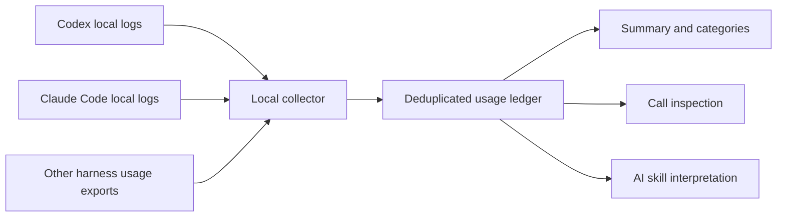

# Token Explorer

**Understand where your AI tokens go.**

Token Explorer is a portable AI skill and a local usage collector for people who want to understand the work behind an AI conversation: which prompts trigger the most processing, how much input is reused from cache, how much output is generated, and which calls deserve a closer look.

It includes native adapters for **Codex** and **Claude Code**, plus a common import format for other models and harnesses. The skill is named **`token-audit`** so the same invocation works across installations.

The collector and command-line reports run locally, make no network requests, and consume no model tokens. Asking an AI to interpret those reports uses that AI's normal tokens.

> Transparency means showing what is measured, what is missing, and what is only a clue. This tool does not claim to observe hidden provider internals or recover usage that was never logged.

## What you can learn

| Question | How to answer it |
|---|---|
| How many tokens have my logged conversations processed? | `summary` |
| Which models or harnesses account for the most usage? | `summary --group-by model` or `--group-by harness` |
| Which user prompts triggered the most work? | `summary --group-by turn_id` |
| How much is input, output, cache usage, or reasoning? | `categories` |
| Which model requests were largest? | `calls --top 5` |
| What happened inside one expensive call? | `inspect CALL_ID --context` |
| Was research or testing more expensive? | `summary --group-by stage`, when your exporter supplies stage labels |

## How it works



The collector reads usage records already written by your harness, normalizes their accounting, and counts each supported request identity once. It produces a ledger, a ranked Markdown report, and a coverage report. A separate read-only command explores that snapshot. The skill tells your AI how to run these commands and explain the results without inventing token attribution.

## Requirements

- Python **3.9 or later**. No third-party Python packages are required.
- Read access to supported local session logs, or request-level usage exports.
- An Agent Skills-compatible harness to invoke the skill. The CLI also works without an AI harness.
- macOS only for the optional built-in launchd background installation. Foreground scanning and imported data work wherever Python runs.
- Access to this private repository and GitHub SSH authentication to clone it.

## Install

### 1. Clone over SSH

```sh
git clone git@github.com:krisnaparahita/Ai-tokenExplorer.git
cd Ai-tokenExplorer
```

### 2. Install the AI skill

Install personal copies for both Codex and Claude Code:

```sh
python3 token-audit/scripts/install.py
```

The installer copies `token-audit/` into:

- Codex: `$CODEX_HOME/skills/token-audit`, falling back to `~/.codex/skills/token-audit`.
- Claude Code: `~/.claude/skills/token-audit`.

It refuses to overwrite an existing installation. For an upgrade, compare and back up any local changes before replacing the skill folder with the new version. Running `git pull` updates the checkout, not previously installed copies. The installer does not change shell startup files, harness instructions, credentials, or hooks.

For a single harness, manually copy only `token-audit/` into that harness's skill directory. For another Agent Skills-compatible harness, use its documented skill location. If discovery is cached, restart the harness or open a new task.

### 3. Collect your first snapshot

From the repository root:

```sh
python3 token-audit/scripts/token_audit.py \
  --out "$HOME/.local/share/token-audit" \
  --include-prompts
```

By default this scans Codex sessions and Claude Code project transcripts, including nested agent transcript files. `--include-prompts` stores a local snippet of up to 160 characters to help identify each prompt. Omit it to store hashed prompt labels instead.

### 4. Use short terminal commands

Define a function in your current bash or zsh session:

```sh
token-audit() {
  python3 "${CODEX_HOME:-$HOME/.codex}/skills/token-audit/scripts/query.py" "$@"
}
```

Add that function to your shell configuration if you want it in future terminals. If you installed only in Claude Code, replace the script path with `$HOME/.claude/skills/token-audit/scripts/query.py`.

```sh
token-audit summary
token-audit categories
token-audit calls --top 5
```

You can always bypass the shell function:

```sh
python3 token-audit/scripts/query.py summary
```

### Optional: automatic background collection on macOS

On a **fresh installation**, use this instead of the skill-only installer:

```sh
python3 token-audit/scripts/install.py --enable-monitor
```

It installs both skills, creates an initial snapshot, and registers a local launchd collector to scan every 60 seconds while you are logged in. The scan also runs at login. This uses no AI calls. Short prompt snippets are enabled for the personal monitor.

If you already installed the skill-only version, the installer will refuse to overwrite it. Use foreground monitoring below, or back up and remove those installed skill copies before running the fresh-install command. Do not remove your source transcripts or report data.

Reports are stored in `~/.local/share/token-audit/`. The service is named `local.token-audit.collector`. The Python interpreter used at installation must remain available. Sleep/logout pauses scanning; the next run reads the available history.

On other platforms, or without a startup service:

```sh
python3 token-audit/scripts/token_audit.py \
  --watch 60 \
  --out "$HOME/.local/share/token-audit" \
  --include-prompts
```

Keep that process running; Ctrl-C stops it. Increase the interval for large histories. Use only one collector per output directory.

## Invoke it in your AI assistant

In Codex:

```text
$token-audit summary
$token-audit categories --harness codex
$token-audit calls --top 5
$token-audit inspect RESPONSE_ID --context
```

In Claude Code:

```text
/token-audit summary
/token-audit summary --group-by turn_id
/token-audit inspect MESSAGE_ID --context
```

These are skill requests interpreted by your assistant, not built-in provider commands. The skill runs the bundled script and explains its JSON output. You can also ask naturally: “Use token-audit to find my most expensive prompts and explain what drove their usage.”

## Command reference

### `summary`: overall usage and rankings

```sh
token-audit summary
token-audit summary --group-by harness
token-audit summary --group-by model
token-audit summary --group-by session_id
token-audit summary --group-by turn_id --top 20
token-audit summary --group-by stage
```

Returns observed call count, processed tokens, category totals with field coverage, and ranked groups. The default grouping is model. A prompt ranking includes all attributed model calls, including repeated context; it is not the token length of the user's sentence. Stages remain `unattributed` unless explicitly supplied by an import.

### `categories`: inspect accounting categories

```sh
token-audit categories --harness claude
```

| Category | Meaning | Add to total? |
|---|---|---|
| `input_tokens` | All recorded input, including normalized cache usage | Yes |
| `output_tokens` | All recorded generated output | Yes |
| `cache_read_tokens` | Input served from cache, where reported | No; already included in input |
| `cache_write_tokens` | Input written to cache, where reported | No; already included in input |
| `reasoning_tokens` | Reasoning portion of output, where exposed | No; already included in output |

**Total processed tokens = input + output.** Each category reports `known_calls` and `total_calls`. A missing breakdown stays unknown; its known subtotal is not a complete total. Estimated imports are excluded from measured summaries and rankings.

### `calls`: find individual requests

```sh
token-audit calls --top 5 --harness codex
```

Returns the largest recorded calls, including their IDs, model, prompt label, token counters, source file, and source line. Copy an `event_id` into `inspect`.

### `inspect`: investigate a specific call

```sh
token-audit inspect RESPONSE_ID
token-audit inspect RESPONSE_ID --context
```

A unique ID prefix is accepted. Ambiguous prefixes are rejected; narrow by `--harness` when necessary.

The basic inspection shows the ledger record and its reported token categories. `--context` additionally reads the source transcript through that usage event and lists:

- Visible character totals by category, such as system instructions, user messages, assistant messages, and tool results.
- The ten largest visible blocks, with source line numbers for further investigation.

**This is a transcript-size investigation, not exact per-section token attribution.** The visible history can include compacted or removed context, duplicated stream blocks, and the current response. It can omit hidden prompts, images, tool schemas, and other provider data. A large tool result is a candidate explanation, not proof that it consumed a particular share of that request's tokens.

### Shared filters

```sh
token-audit summary --harness codex --since 2026-09-25
token-audit calls --session SESSION_ID --top 10
token-audit categories --ledger /path/to/ledger.jsonl
```

| Option | Behavior |
|---|---|
| `--harness NAME` | Exact harness filter, e.g. `codex`, `claude`, or an imported harness name |
| `--session ID` | Exact conversation/session filter |
| `--since DATE` | Inclusive ISO-8601 date or timestamp; date-only means UTC midnight |
| `--ledger PATH` | Read another snapshot; default is `~/.local/share/token-audit/ledger.jsonl` |
| `--top N` | Maximum ranked results; default 10 |
| `--group-by FIELD` | Summary grouping field |

Rows without usable timestamps are excluded when `--since` is used. All query output is JSON. Snapshot coverage warnings apply to the whole source scan, not just the filtered rows.

### Collector options

```sh
python3 token-audit/scripts/token_audit.py \
  --codex /path/to/codex/sessions \
  --claude /path/to/claude/projects \
  --import-jsonl /path/to/other-harness.jsonl \
  --out /path/to/reports
```

| Option | Behavior |
|---|---|
| `--codex PATH` | Read a Codex transcript file or recursively scan a directory; repeatable |
| `--claude PATH` | Read a Claude transcript file or directory; repeatable |
| `--import-jsonl PATH` | Read compatible request-level exports; repeatable |
| `--out PATH` | Output directory; default `./token-audit-output` |
| `--include-prompts` | Store short local prompt snippets instead of hashes |
| `--watch SECONDS` | Rescan until stopped; minimum 10 seconds |

Once an explicit source is supplied, **only explicit sources are scanned**. Include an extra `--codex` path for archived sessions. Do not place generated outputs inside source directories or import the generated ledger as an export.

## Try it with synthetic data

No personal logs or provider access are needed:

```sh
python3 token-audit/scripts/token_audit.py \
  --import-jsonl examples/demo.jsonl --out /tmp/token-explorer-demo --include-prompts
python3 token-audit/scripts/query.py summary --ledger /tmp/token-explorer-demo/ledger.jsonl
python3 token-audit/scripts/query.py categories --ledger /tmp/token-explorer-demo/ledger.jsonl
python3 token-audit/scripts/query.py inspect demo-research --ledger /tmp/token-explorer-demo/ledger.jsonl
```

The example has 2 measured calls and **14,000 processed tokens**, plus one estimated call kept separately. It demonstrates OpenAI-style cache-inclusive input and Anthropic-style separate cache counters. All examples are fabricated.

## Other models and harnesses

A model does not need to be named in this project. It needs a harness that exposes per-request usage, stable request IDs, and enough metadata for attribution. Export those records as `token-audit/v1` with `usage_kind` set to `openai`, `anthropic`, or `canonical`.

See the [adapter contract](token-audit/references/adapters.md) and [synthetic export](examples/demo.jsonl). For research/testing/planning categories, attach explicit `stage` labels to each request. Map other provider counters only after checking their accounting semantics.

This project does not install browser extensions, intercept network traffic, configure OpenTelemetry, or connect to provider billing APIs. Web-only ChatGPT/Claude conversations without usage exports cannot be measured exactly by this collector.

## Accuracy and coverage

- Native transcript formats can change. Unsupported records, inaccessible files, and malformed lines produce coverage warnings.
- Codex modern per-response records are preferred over duplicate cumulative counters. Legacy-only logs use cumulative differences; the first baseline and resets are excluded. Legacy totals are therefore a lower bound.
- Mixed Codex formats prefer modern records and can omit legacy-only portions of the history.
- Claude repeated stream records are coalesced by identity, keeping the largest observed counters. This assumes monotonic streaming usage.
- Claude and legacy prompt attribution is positional and can be ambiguous with steering, branching, or copied history.
- Child sessions are counted separately when their logs exist; the tool does not build a parent-child attribution graph.
- Unlogged retries, remote workers, hidden provider activity, and still-running responses remain gaps.
- Tokenization differs across providers. Token volume is not a provider-independent measure of work, money, or quality.
- Costs and subscription allowance percentages are intentionally not inferred.

## Local data and privacy

The collector makes no network requests and leaves source logs unchanged. Reports contain conversation IDs, source paths, models, token counts, and optionally short prompt snippets. Treat them as private. Prompt hashing does not anonymize all metadata.

Generated telemetry, reports, logs, caches, and local environment files are excluded by `.gitignore`; only the explicitly synthetic example is included. Review staged files before sharing your own changes.

Each scan rebuilds the snapshot from currently available sources. It is **not a permanent archive**: deleting source transcripts removes their records from future snapshots. The collector does not enforce token budgets or stop an AI task.

## Stop or remove the background collector

On macOS:

```sh
launchctl bootout "gui/$(id -u)" "$HOME/Library/LaunchAgents/local.token-audit.collector.plist"
```

Remove that exact plist to prevent startup at the next login. Installed skill folders and report data can be removed separately if no longer wanted. Keep source conversation logs unless you independently intend to delete them.

## Repository structure

```text
Ai-tokenExplorer/
├── README.md
├── .gitignore
├── docs/
│   └── development.md
├── examples/
│   └── demo.jsonl                  Synthetic cross-provider usage
└── token-audit/                    Portable skill folder
    ├── SKILL.md                    AI instructions and command routing
    ├── references/
    │   ├── adapters.md             Accounting and export contract
    │   └── operation.md            Installation and monitoring
    ├── scripts/
    │   ├── install.py              Skill installation and optional launchd setup
    │   ├── token_audit.py          Parsing, normalization, deduplication, reporting
    │   └── query.py                Read-only summaries and call inspection
    └── tests/                     Accounting and query regression tests
```

See [development notes](docs/development.md) for internal functions and test commands.
